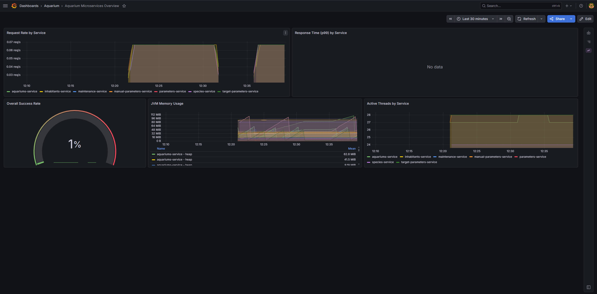

# Aquarium Microservices


Microservice backend for comprehensive aquarium management — tanks, inhabitants, species catalog, maintenance tracking, and water parameter monitoring.

Built with **Java 17, Spring Boot 3.3.5, Spring Cloud Gateway, Apache Kafka (KRaft), PostgreSQL 16, Resilience4j**. Fully containerized with Docker Compose, monitored via Prometheus and Grafana.

> Designed to work alongside the [Aquarium Interface](https://github.com/F3rren/Aquarium-interface) Flutter frontend.

---

## Quick Start (local)

**Only prerequisite: [Docker Desktop](https://www.docker.com/products/docker-desktop/)**

```bash
git clone https://github.com/F3rren/aquarium-ms.git
cd aquarium-ms
docker-compose up -d
```

| Service | URL |
|---------|-----|
| Homepage (dashboard) | http://localhost:3001 |
| API Gateway + Swagger UI | http://localhost:8080/swagger-ui.html |
| Kafka UI | http://localhost:8090 |
| Grafana | http://localhost:3000 (admin / admin) |
| Prometheus | http://localhost:9090 |

> **Homepage** is a static landing page (`ghcr.io/gethomepage/homepage`) aggregating every
> service, its live health, and the observability tools. Config lives in
> `observability/homepage/*.yaml`. It deliberately does **not** mount the Docker socket —
> health is checked over HTTP against each service's `/actuator/health` instead.

---

## Authentication

Every gateway route requires a valid JWT (`Authorization: Bearer <token>`) except `/auth/login`, `/actuator`, `/swagger-ui`, and `/v3/api-docs` — deny-by-default, enforced once at the edge by `JwtAuthFilter` in `api-gateway`. None of the seven downstream services validate a token themselves; they trust the `X-User-Id` header the gateway injects (and strips from the raw request first, so a caller can't set it directly to impersonate someone else) — safe only because those services are reachable exclusively through the gateway on the Docker network, never on a published host port.

There are two fixed test identities, not a real user system — just enough to give a security scan two distinct identities to compare:

```bash
curl -X POST http://localhost:8080/auth/login \
  -H "Content-Type: application/json" \
  -d '{"username": "userA", "password": "'"$AUTH_USER_A_PASSWORD"'"}'
# => {"token": "...", "userId": "1"}

curl http://localhost:8080/aquariums \
  -H "Authorization: Bearer <token from above>"
```

**Authentication vs. authorization — an intentional gap.** `aquariums-service` enforces both, but not on the same endpoint: `PUT`/`DELETE /aquariums/{id}` check that the caller actually owns the aquarium (403 if not); `GET /aquariums/{id}` only requires *a* valid identity, not the *right* one — any authenticated user can read any aquarium by id, regardless of who created it. This is a deliberate IDOR (Insecure Direct Object Reference) test fixture, left in place on purpose so a security scan (e.g. [Sentinel](https://github.com/F3rren/Sentinel)'s IDOR module) has something real to find: authenticate as both `userA` and `userB`, create an aquarium as one, and try reading it as the other.

---

## Architecture

```
                   ┌─────────────────────────────────────┐
                   │         API Gateway :8080           │
                   │  (routing · CORS · request logging) │
                   └──────────────┬──────────────────────┘
                                  │
     ┌──────────────┬─────────────┼──────────────┬───────────────┐
     ▼              ▼             ▼              ▼               ▼
aquariums-service  inhabitants-  species-      maintenance-   parameters-
    :8081           service       service        service        service
                     :8082         :8083          :8084          :8085

                                           manual-parameters-service :8086
                                           target-parameter-service  :8087
```

**Synchronous (HTTP):** `inhabitants-service` → `species-service` for species enrichment. `aquariums-service` → parameter services via circuit breaker + retry.

**Asynchronous (Kafka):**
- `aquarium.lifecycle` — cascade delete across inhabitants, parameters, maintenance
- `parameter.measurements` — triggers CQRS read model update and anomaly alert creation

---

## Key Patterns

| Pattern | Where | Purpose |
|---------|-------|---------|
| **Transactional Outbox** | `aquariums-service` | Zero message loss — events written to DB and Kafka atomically |
| **CQRS** | `parameters-service` | Separate write (`water_parameters`) and read (`parameter_latest`) models |
| **Idempotent consumer** | all consumers | Deduplication via `processed_events` table, safe with Kafka at-least-once |
| **`@RetryableTopic` + DLT** | all `@KafkaListener` | 3 retries with exponential backoff, failed events land on `.DLT` topic |
| **Circuit breaker + retry** | `aquariums-service` | Resilience4j protects inter-service HTTP calls |
| **Parameter anomaly alerts** | `maintenance-service` | Auto-creates high-priority task when temp or pH is out of safe range |

---

## Observability



- **Grafana:** http://localhost:3000 — pre-built dashboard "Aquarium Microservices - Overview"
- **Prometheus:** http://localhost:9090 — raw metrics and target status

Request rate, JVM memory, active threads, and success rate across all 7 services. Dashboard auto-provisioned on `docker-compose up`.

---

## Configuration

Copy `.env.example` to `.env` to override local defaults — the file is gitignored and never committed.

```bash
cp .env.example .env
```

| Variable | Default | Used by |
|----------|---------|---------|
| `DB_USER` | `postgres` | postgres container + all Spring services |
| `DB_PASSWORD` | _(required, no default)_ | same |
| `GF_ADMIN_USER` | `admin` | Grafana |
| `GF_ADMIN_PASSWORD` | _(required, no default)_ | Grafana |
| `KAFKA_UI_USER` | `admin` | Kafka UI |
| `KAFKA_UI_PASSWORD` | _(required, no default)_ | Kafka UI |
| `SWAGGER_ENABLED` | `false` | api-gateway — exposes Swagger UI; local development only |
| `JWT_SECRET` | _(required, no default)_ | api-gateway — signs/validates every JWT it issues |
| `AUTH_USER_A_PASSWORD` | _(required, no default)_ | api-gateway — password for the `userA` test identity |
| `AUTH_USER_B_PASSWORD` | _(required, no default)_ | api-gateway — password for the `userB` test identity |
| `RATE_LIMIT_ENABLED` | `true` | api-gateway — general per-IP throttling on every routed request |
| `AUTH_RATE_LIMIT_ENABLED` | `true` | api-gateway — brute-force protection specifically on `POST /auth/login` |
| `HOMEPAGE_ALLOWED_HOSTS` | `localhost:3001` | homepage dashboard — host header(s) it accepts |

> **Note:** the `dev` Spring profile (relaxed Flyway/validation, verbose logging - see each
> service's `application-dev.properties`) is not wired through `docker-compose.yml` at all; it's
> meant for running a single service directly from an IDE against locally-running infra, not for
> the full Docker Compose stack. `SPRING_PROFILES_ACTIVE` has no effect here.

---

## Tech Stack

| Layer | Technology |
|-------|-----------|
| Language | Java 17 |
| Framework | Spring Boot 3.3.5 |
| Gateway | Spring Cloud Gateway |
| Persistence | Spring Data JPA, Hibernate, Flyway |
| Database | PostgreSQL 16 |
| Messaging | Apache Kafka 3.7 (KRaft), Spring Kafka |
| Resilience | Resilience4j (circuit breaker + retry) |
| Containerization | Docker, Docker Compose |
| CI/CD | GitHub Actions |
| Metrics | Prometheus, Grafana |

---

## Previous Version

Microservice evolution of [aquarium-monitor](https://github.com/F3rren/aquarium-monitor), the original monolithic backend.

---

MIT © F3rren
